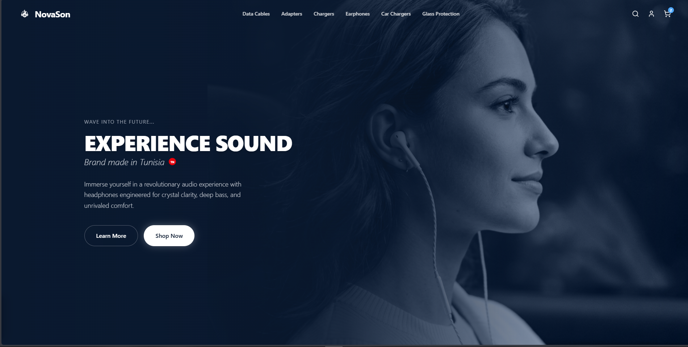
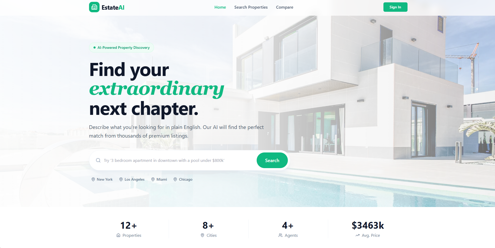
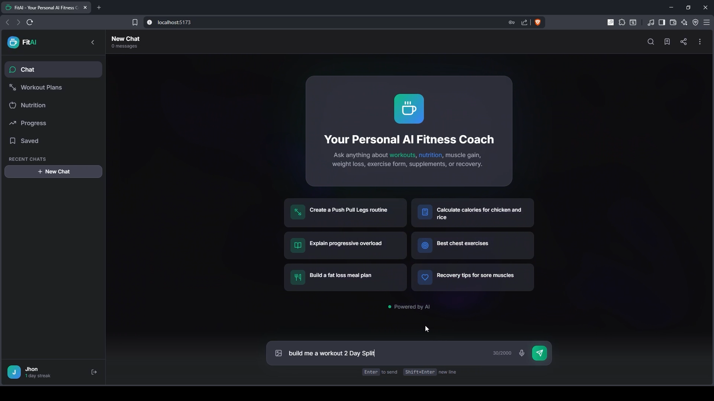
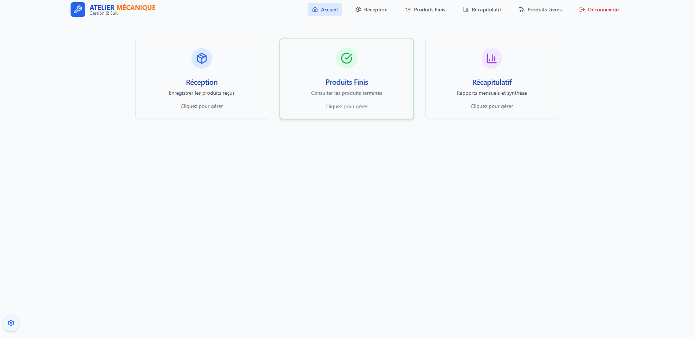
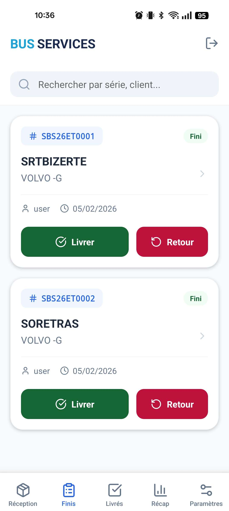

<!-- ====================================================== -->
<!--                       HEADER                           -->
<!-- ====================================================== -->

<h1 align="center">Hi, I'm Mohamed El Ouardi</h1>

  

  <strong>Computer Science Graduate • Full-Stack JavaScript Developer</strong>

Passionate about building modern, scalable, and high-performance web applications with clean architecture and exceptional user experiences.

---

# About Me

I'm a **Computer Science graduate** and **Full-Stack JavaScript Developer** passionate about building modern web applications that combine clean architecture, responsive design, and exceptional user experiences.

My primary stack includes **React**, **TypeScript**, **Tailwind CSS**, **Node.js**, **Express.js**, **MongoDB**, and REST APIs. I enjoy transforming complex ideas into intuitive, production-ready applications while following scalable development practices.

I build projects that solve real-world problems—from AI-powered applications and interactive dashboards to premium e-commerce platforms and map-based real estate systems. Every project is an opportunity to improve performance, write maintainable code, and explore modern technologies.

---

# Tech Stack

## Frontend

## Backend

## Languages

## Tools

<!-- ====================================================== -->
<!--                  FEATURED PROJECTS                     -->
<!-- ====================================================== -->

<h1 align="center">
  Featured Projects
</h1>

  A showcase of my work across frontend engineering, full-stack development,
  AI integration, and real-world software solutions.

 

<table>
<tr>

<!-- NOVASON -->

<td width="50%" valign="top">

<h2 align="center">NovaSon</h2>

<strong>Premium Audio & Tech Accessories E-Commerce</strong>

A modern e-commerce experience built for technology and audio enthusiasts.
Focused on premium UI design, smooth interactions, and scalable frontend architecture.

<h3>Highlights</h3>

<ul>
<li>Modern responsive shopping experience</li>
<li>Product-focused UI/UX</li>
<li>Smooth animations and interactions</li>
<li>Reusable component architecture</li>
</ul>

<h3>Stack</h3>

</td>

<!-- ESTATEAI -->

<td width="50%" valign="top">

<h2 align="center">EstateAI</h2>

<strong>Real Estate Property Finder</strong>

A production-inspired real estate platform focused on usability,
responsive design, and interactive map-based property exploration.

<h3>Highlights</h3>

<ul>
<li>Interactive property exploration</li>
<li>Leaflet map integration</li>
<li>Responsive modern interface</li>
<li>Smooth animations and transitions</li>
<li>Reusable React components</li>
</ul>

<h3>Stack</h3>

</td>

</tr>

<tr>

<!-- GYMBOT -->

<td width="50%" valign="top">

<h2 align="center">GymBot</h2>

<strong>AI Fitness & Nutrition Assistant</strong>

A full-stack AI-powered fitness platform that generates personalized
workouts, nutrition plans, and tracks user progress.

<h3>Highlights</h3>

<ul>
<li>AI-generated workout programs</li>
<li>Nutrition planning with macro calculations</li>
<li>Interactive workout and meal cards</li>
<li>Workout scheduling calendar</li>
<li>Authentication and user profiles</li>
</ul>

<h3>Stack</h3>

</td>

<!-- BUS PLATFORM -->

<td width="50%" valign="top">

<h2 align="center">Bus Maintenance Platform</h2>

<strong>Enterprise Workshop Management System</strong>

A web and mobile platform designed to digitize maintenance workflows,
spare parts management, and repair tracking.

<h3>Highlights</h3>

<ul>
<li>Spare parts management</li>
<li>Reception, repair, and delivery tracking</li>
<li>Centralized workshop operations</li>
<li>Web and mobile accessibility</li>
</ul>

<h3>Status</h3>

Private Enterprise Project

</td>

</tr>

</table>

<!-- ====================================================== -->
<!--              CURRENTLY WORKING ON                     -->
<!-- ====================================================== -->

<h2 align="center">Currently Working On</h2>

  Building modern, scalable applications and continuously improving my engineering skills.

<table align="center">
<tr>
<td width="50%">

<h3 align="center">Production Applications</h3>

Developing full-stack projects focused on clean architecture, performance, and real-world usability.

</td>

<td width="50%">

<h3 align="center">DevOps & Deployment</h3>

Exploring CI/CD pipelines, cloud deployment, containerization, and modern development workflows.

</td>
</tr>

<tr>

<td width="50%">

<h3 align="center">Scalable Architecture</h3>

Learning advanced patterns for building maintainable and scalable software systems.

</td>

<td width="50%">

<h3 align="center">Frontend Excellence</h3>

Improving UI performance, accessibility, animations, and user experience.

</td>

</tr>
</table>

<!-- ====================================================== -->
<!--                OPEN TO OPPORTUNITIES                  -->
<!-- ====================================================== -->

<h2 align="center">Open To Opportunities</h2>

I'm currently interested in opportunities where I can build impactful software and contribute to strong engineering teams.

<table>
<tr>

<td align="center" width="200">

<h3>Frontend</h3>

React 
TypeScript 
Tailwind CSS

</td>

<td align="center" width="200">

<h3>Full Stack</h3>

Node.js 
Express.js 
MongoDB

</td>

<td align="center" width="200">

<h3>Work Style</h3>

Remote 
On-site 
Freelance

</td>

</tr>
</table>

<!-- ====================================================== -->
<!--                  GITHUB STATS                         -->
<!-- ====================================================== -->

<h2 align="center">GitHub Analytics</h2>

 

<!-- ====================================================== -->
<!--                GITHUB TROPHIES                        -->
<!-- ====================================================== -->

<h2 align="center">Achievements</h2>

<!-- ====================================================== -->
<!--              CONTRIBUTION GRAPH                       -->
<!-- ====================================================== -->

<h2 align="center">Contribution Activity</h2>

<!-- ====================================================== -->
<!--                 VISITOR COUNTER                       -->
<!-- ====================================================== -->

 

 

<h3 align="center">
Thanks for visiting my profile.
</h3>